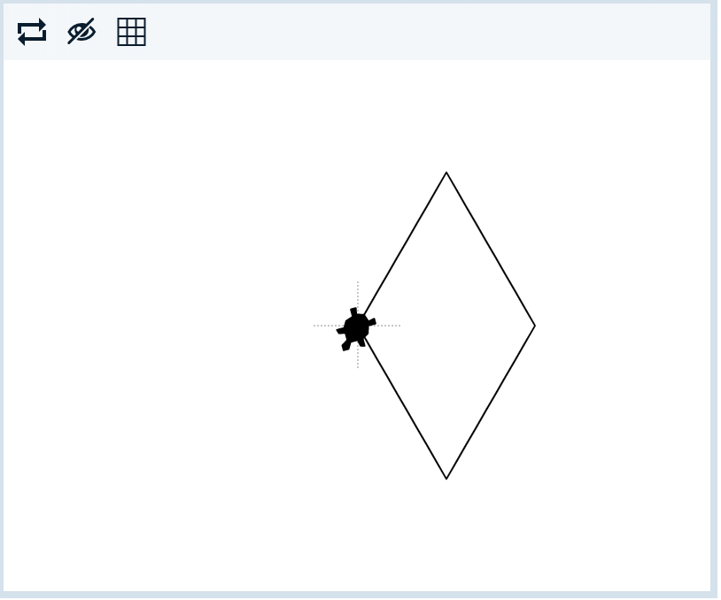

# Problem Statement

The turtle has a cold and is trying to make a [lozenge](https://en.wikipedia.org/wiki/Throat_lozenge) to soothe its sore throat, like this:

    

1. Run the program.
2. That's not going to help a sore throat! Try changing the last turn and side to draw the lozenge correctly.
3. Don't forget to mark your program so the turtle can get some relief!

© 2021 Grok Learning