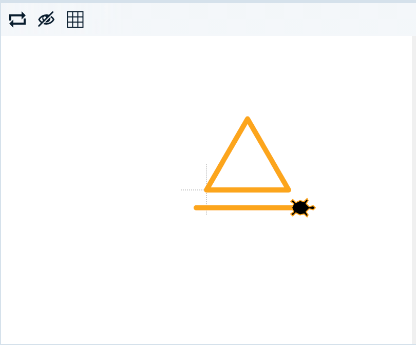

# Problem Statement

Triangles are used across cultures, religions and media as powerful symbols. One way the triangle is used is to symbolise *fire*.

Let's draw a *fire triangle* like this:

1. Set the `pencolor` to `orange` and the `pensize` to `5`. This will make it look *firey*.

2. Go `forward` by 80 steps to draw the base of the triangle. Turn `left` by 120 degrees and go `forward` another 80 steps to draw the right side of the triangle.

3. Run your code to see how it looks! If it looks good, then fill in the left hand side of the triangle.

4. Next lift your pen with `penup`, move 20 steps `forward`, and turn `left` by 120 degrees. Put the pen down and draw a 100 step long underline.

5. Run your code, check if it looks right, then mark it!

© 2021 Grok Learning