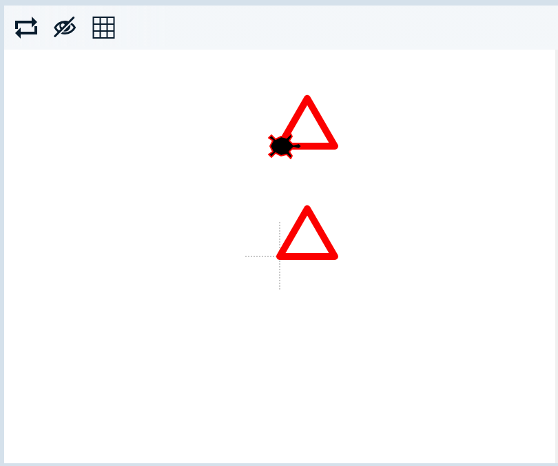
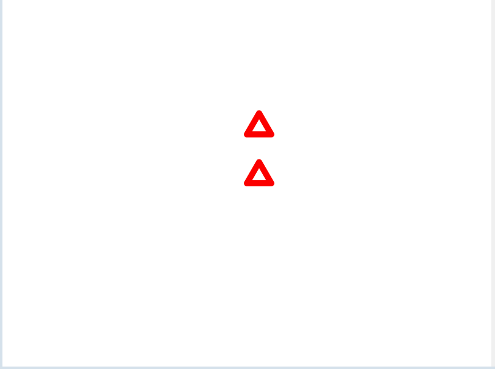

Lets draw some arrows!

We’ll ask the user how big the arrows should be.

    Size? 40

1. Ask for the size and store it in a variable called `size`. Don't forget to convert it to an integer and you'll need to leave a space after the question mark.

2. Set the `pencolor` to `red` and the `pensize` to `5`.

3. Lets draw the first arrow. Move `forward()` using the `size` variable. Then turn `left(`) by `120` degrees. Repeat this **two** more times to draw the first arrow.

4. Now we need to draw the gap between the two arrows! Lift your `penup()`, turn `left()` by `90` degrees, move `forward()` using `size` twice, turn `right()` by `90` degrees and place the pen back down.

5. Finally we need to draw the second arrow! Repeat step 3 to draw it.

6. Run your code with different input, it should work for any size. If it looks right, then mark it!

        Size? 20

    

© 2021 Grok Learning