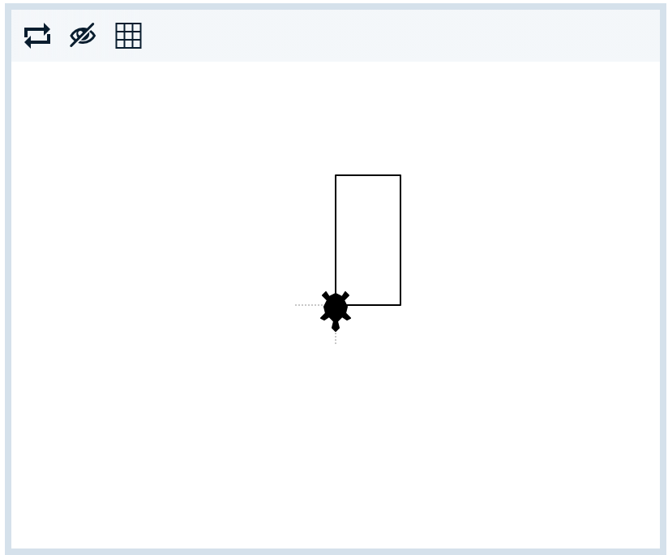

# Problem Statement

Let's make a box!

We've given you the sizes for the **short** and **long** sides, and have started the box. You need to complete it!

It should look like this:

    

1. Click run to see what the program draws so far.

    The turtle moves `forward` the number of steps saved in `short_side`, then turns `left` ready to draw the next side.

2. Move `forward` to draw the first long side. Use the variable `long_side` for the number of steps.

3. Keep going! The rest of the code is up to you.

    Run your code often to see if the turtle is on track.

4. Don't forget to mark your program!

© 2021 Grok Learning